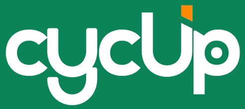

# 👋 Hi, I'm Ata Badr Barzegar

---

# 🚀 CycUp

  

### 🌍 About CycUp

**CycUp** is a sustainability marketplace for students in Finland that helps make student life more affordable.

Students can:

* 🛒 Buy affordable second-hand items
* 💰 Sell items they no longer need
* 🎁 Give items away for free
* 🔄 Rent items temporarily

---

### 🔗 Repository

Follow the project here:
https://github.com/CycUpOfficial/crud-backend
